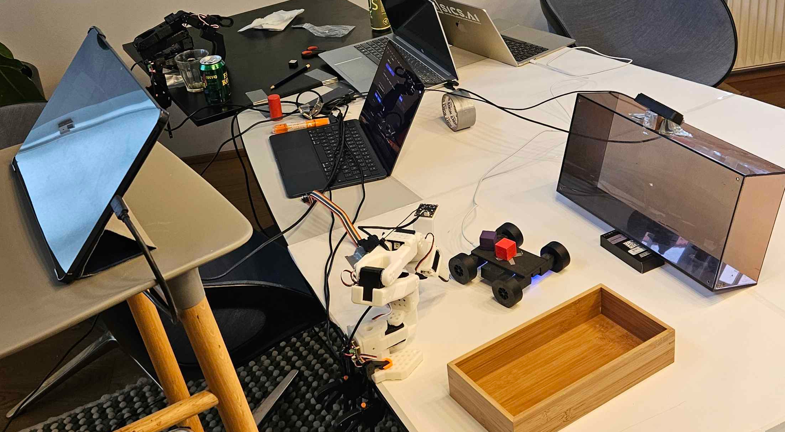
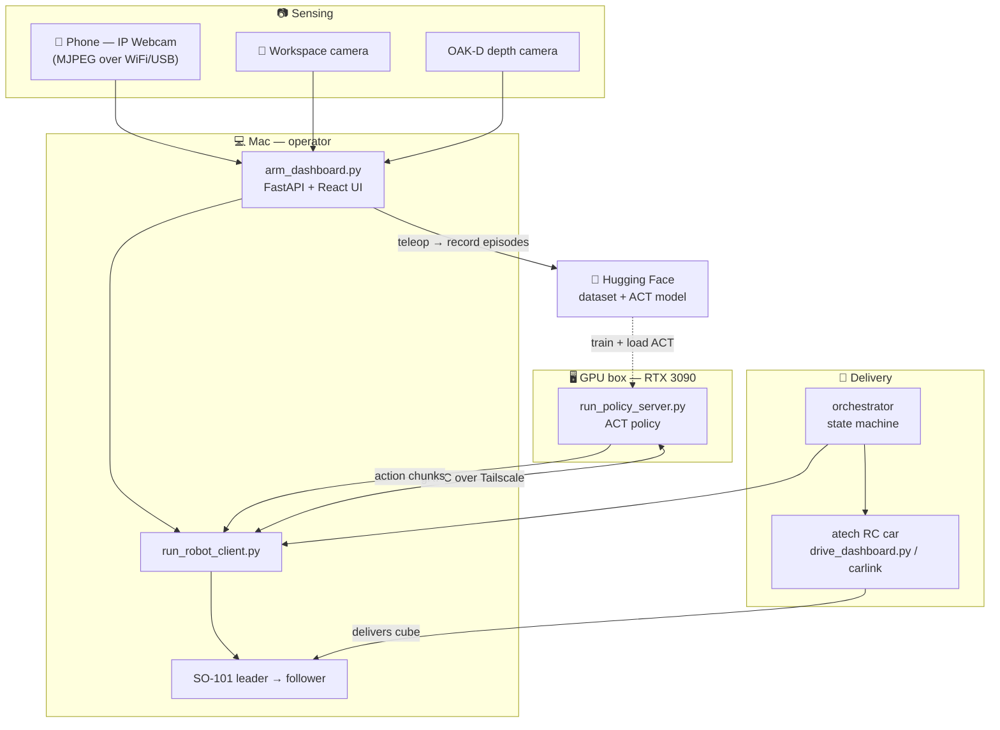

# 🏭 minifactory

**A two-robot pick-and-place "minifactory" — an autonomous RC car delivers a cube, and a
SO-101 arm running a learned ACT policy picks it up and drops it in the bin.**

🏆 *Built at a hackathon.* &nbsp;·&nbsp; Powered by [LeRobot](https://github.com/huggingface/lerobot)

## What it is

**minifactory** is a tabletop imitation-learning rig that closes a full
deliver → pick → place loop between **two robots**:

- An **[atech RC car](docs/car.md)** carries a small cube across the table and parks at a
  pickup station in front of the arm.
- A **SO-101 robotic arm**, driven by a learned **ACT policy**, watches the scene through
  an Android phone (used as a wireless camera), a workspace camera, and an OAK-D depth
  camera. It reaches down, grasps the cube off the car, swings over, and drops it into a
  wooden bin.

The interesting part is *how the robot learns to do this*. We teleoperate the arm
(a **leader** arm puppeteering the **follower**) to record demonstrations as
[LeRobot](https://github.com/huggingface/lerobot) datasets, merge the sessions, and push
them to the Hugging Face Hub. A trained **ACT** policy then runs **remote inference on a
GPU box** — the Mac owns the arm and cameras and streams observations over gRPC
(via Tailscale); the GPU box returns action chunks in real time. No cloud camera, no
custom drivers: the phone just serves an MJPEG stream that LeRobot opens directly.

> The clip above is the real system: the cube is loaded onto the car, the car drives to
> the station, and the policy-driven arm picks it up and bins it — fully autonomously.

## The rig

*SO-101 leader + follower arms, an Android phone running IP Webcam as a wireless camera,
an OAK-D depth camera, the atech RC car, and a GPU box (RTX 3090) running the policy
server over Tailscale.*

## Architecture

## Models & data

| | Hugging Face |
|---|---|
| 🧠 **Policy** (ACT, trained on the merged dataset) | **[nsuprun/merged-so101-49904152](https://huggingface.co/nsuprun/merged-so101-49904152)** |
| 📦 **Dataset** (SO-101 cube pickup, merged sessions) | **[nsuprun/so101-pickup-merged](https://huggingface.co/datasets/nsuprun/so101-pickup-merged)** |

## Quickstart

Three pieces — **phone**, **GPU box** (inference), **Mac** (arms + dashboard). Run `make`
to see all commands.

1. **Phone:** open **IP Webcam** → *Start server* (same WiFi as the Mac). → [details](docs/cameras.md)
2. **GPU box** (once / when needed): `make server-deploy` — deploys + starts the policy
   server on the 3090 over Tailscale. It stays running. → [details](docs/inference.md)
3. **Mac:** plug in both SO-101 arms, then `make dashboard` → open
   **http://localhost:8041** (login `admin` / `123123`).
   - **Connect arms** → **Start teleop** (leader drives follower), or
   - **Run inference** → the dashboard launches the remote client; the ACT policy on the
     GPU box drives the follower from the phone + wrist cameras.

First time only: `make find-port` (set ports in `.env`) and calibrate
(`make calibrate-follower` / `make calibrate-leader`) — though calibration is already
committed for our arms. → [details](docs/arms.md)

## Documentation

| Doc | What's inside |
|-----|---------------|
| 📷 **[docs/cameras.md](docs/cameras.md)** | Phone (IP Webcam) setup, network check, `.env`, verifying ingestion, USB streaming, OAK-D |
| 🦾 **[docs/arms.md](docs/arms.md)** | SO-101 ports, motor IDs, calibration, the dashboard UI, teleop, login |
| 🧠 **[docs/inference.md](docs/inference.md)** | Running a policy — local on the Mac, or remote gRPC on the GPU box (Tailscale / SSH), Ansible deploy |
| 📦 **[docs/datasets.md](docs/datasets.md)** | Recording demonstrations, merging, re-encoding, publishing to the Hub, episode viewer |
| 🚗 **[docs/car.md](docs/car.md)** | The atech RC car — driving (USB / WiFi), firmware, record-replay, troubleshooting |
| 🧭 **[docs/orchestrator.md](docs/orchestrator.md)** | Multi-robot mission state machine coordinating car delivery with arm pickup |

## Tech stack

- **Robot learning:** [LeRobot](https://github.com/huggingface/lerobot) (SO-101 drivers,
  datasets, ACT/SmolVLA/pi0 policies, async gRPC inference) · PyTorch
- **Dashboards:** FastAPI · React + Vite + Tailwind (built bundle served by FastAPI)
- **Cameras:** Android *IP Webcam* (MJPEG over WiFi/USB) · Luxonis OAK-D (DepthAI)
- **Networking:** Tailscale (mesh VPN) or SSH tunnel · Ansible for GPU-box deploy
- **RC car:** ESP32-S3 firmware + the `carlink` Python control layer

> **Note:** the `.env` in this repo is committed on purpose for the hackathon — every
> credential in it is a throwaway, LAN-only value. Never put a real secret there;
> gated-model tokens go in the gitignored `.env.local`.

## License

See [LICENSE](LICENSE).
